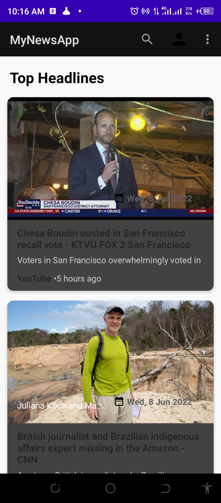

# Project Name
The NeWS
___
# Project Description
It is a an application which an API ia called and the various news are displayed.
___
# Project Owner
David Ndungu
___
## Technologies Used
Android
Gradle
Maven
Retrofit
Postman
___
## Languages Used
Java Android
___
## Getting Started
use `git clone` 
>https://github.com/david8203/NewsApplication.git
* clone it in your desired repository and launch it with your desired IDE.
* create a device manager if it does not exist and run the project.
___
## Gradle Dependencies

    implementation 'androidx.appcompat:appcompat:1.4.2'
    implementation 'com.google.android.material:material:1.6.1'
    implementation 'androidx.constraintlayout:constraintlayout:2.1.4'
    testImplementation 'junit:junit:4.13.2'
    androidTestImplementation 'androidx.test.ext:junit:1.1.3'
    androidTestImplementation 'androidx.test.espresso:espresso-core:3.4.0'
    //noinspection GradleCompatible
    implementation 'com.android.support:design:29.0.0'
    implementation 'androidx.cardview:cardview:1.0.0'
    implementation 'androidx.recyclerview:recyclerview:1.2.1'

    implementation 'com.github.bumptech.glide:glide:4.11.0'
    annotationProcessor 'com.github.bumptech.glide:compiler:4.11.0'
    implementation 'de.hdodenhof:circleimageview:3.0.1'

    implementation 'com.squareup.retrofit2:retrofit:2.5.0'
    implementation 'com.squareup.retrofit2:converter-gson:2.5.0'

    implementation 'androidx.legacy:legacy-support-v4:1.0.0'
    implementation 'com.github.rey5137:material:1.0.0'
    implementation 'org.ocpsoft.prettytime:prettytime:4.0.1.Final'

`
___
## Add News Api
You need to create a **[News API key](https://newsapi.org/docs/endpoints/sources)** and `add` it in the mainActivity.
___
## Screenshots

## Api Documentation
[Api Docs](https://newsapi.org/docs/endpoints/sources)
___
## Bugs
* no known bugs detected.
___
## Features
The News has categories of news which include:
*Entertainment
*Science
*Technology
*Health
*Sports
*News search.
*News detail.
*Open the news source URL.
___
# Application Architecture
*IDE: Android Studio
*API: News API
*Arthitecture: MVVM
*Programming Language: Java
*Third Party Libraries: Retrofit, Glide, ButterKnife, Gson
___
## License
Copyright (C) Achmad Qomarudin

    Licensed under the Apache License, Version 2.0 (the "License");
    you may not use this file except in compliance with the License.
    You may obtain a copy of the License at

       http://www.apache.org/licenses/LICENSE-2.0

    Unless required by applicable law or agreed to in writing, software
    distributed under the License is distributed on an "AS IS" BASIS,
    WITHOUT WARRANTIES OR CONDITIONS OF ANY KIND, either express or implied.
    See the License for the specific language governing permissions and
    limitations under the License.
